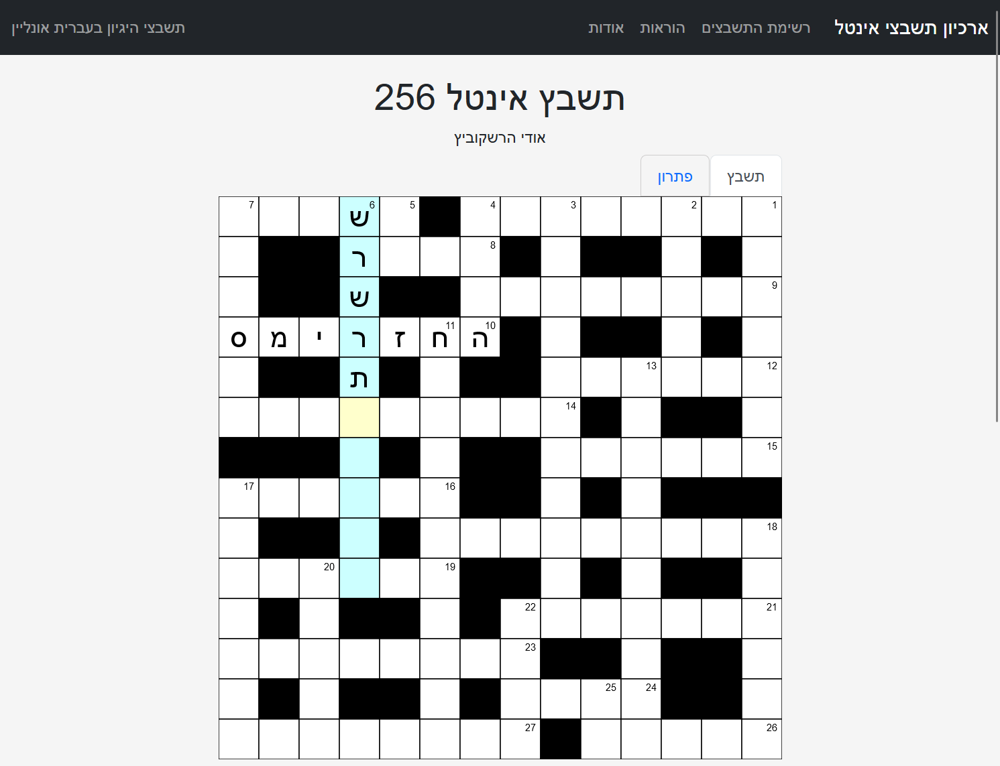

# Online Cryptic Crosswords in Hebrew - תשבצי היגיון בעברית אונליין

Every week, since 2013, two of my colleagues (Udy Hershkovitz from [PinatKafe.com](https://pinatkafe.com) and David Zahavi)
have been publishing a weekly Cryptic Crossword in a dedicated mailing list.

This repository contains an archive of the crosswords themselves as well as a mobile-friendly web 
user-interface allowing users to attempt and solve the crosswords online. 

The crossword puzzles are available online [here](https://dvd848.github.io/cryptic-crossword/).

## Features

 * Remembers your session on a given browser - allows to stop and continue later
 * Offers the ability to check your solution or view the official solution
   * Solutions are published a week after the original puzzle is released
 * Mobile-friendly user-interface
 * Allows marking clues as completed
 * Allows sharing the current state with other people (or browsers) via a dedicated share link
   * This can be used, for example, to move easily between a desktop and a mobile device

## How to solve a Cryptic Crossword?

 * [Tips from Dekel Beno - YNet](https://www.ynet.co.il/articles/0,7340,L-5455858,00.html)
 * [guterzon.com](http://www.guterzon.com/chida/learn.htm)

## Alternatives

There are a few alternatives that offer cryptic crosswords in Hebrew online:

 * [haaretz.co.il](https://www.haaretz.co.il/gallery/xword)
 * [14across.co.il](https://www.14across.co.il/)
 * [higayon.co.il](http://www.higayon.co.il/)
 * [ravmilim.co.il](https://blog.ravmilim.co.il/tasbetson/)
 * [Android Application](https://play.google.com/store/apps/details?id=crosswords.higayon)

## Development

Developed using TypeScript, crossword itself is built as a dynamic SVG.
All the logic is implemented on the client side and only requires a static server.

The project includes a Docker file that can be used to setup the website locally.  

### Running Locally

 1. Build the container with `docker-compose up -d --build`
 2. Run the container with `docker-compose up -d`
 3. Attach to the container with `docker-compose exec app sh`
 4. (First time only) Install the packages from `npm` using `npm install`
 5. Run `npm start` to start the server
 6. Alternatively run `npx webpack --mode production` to bundle the code. This would result in some `*.js` files being written to `dist`
 7. When done, execute `exit` to exit the shell
 8. Execute `docker-compose down` to stop the container

For the online version hosted in GitHub Pages, changes to the Typescript files only take effect once the code is bundled and submitted to GitHub.  
This should happen automatically with a GitHub Action.

### Uploading a New Crossword Puzzle

The original crossword puzzles are published as a `docx` file and need to be converted to `json` format before being uploaded to this website.

 1. Download the new crossword puzzle from [pinatkafe.com](https://pinatkafe.com/%d7%aa%d7%a9%d7%91%d7%a6%d7%99-%d7%94%d7%92%d7%99%d7%95%d7%9f/)
    1. Note: If the `docx` with the solution is selected, the solutions will extracted from the document and made available via the website as well
 2. Place it under `./tmp/docs/`
 3. Run `./utils/doc2json/doc2json.py` directly or via the docker (`docker-compose run --rm doc2json`)
    1. This will automatically convert the `docx` format to `json` and place the result under `./crosswords/<crossword_id>.json`
 4. Run `./utils/create_index/create_index.py` to update `./index.json` with the new puzzle ID
    1. When pushing to GitHub, this should happen automatically with a GitHub Action

## Contributions

Issues and code contributions are welcome. For comments about the crosswords themselves, please contact Udy directly via his
[contact details](https://pinatkafe.com/%d7%90%d7%95%d7%93%d7%95%d7%aa/).

## License

The web interface is released under MIT.

The rights for the crosswords puzzles themselves belong to their original creators. Each puzzle includes the name of its author(s).